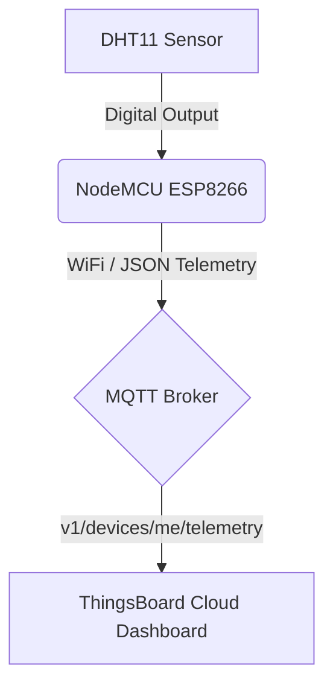
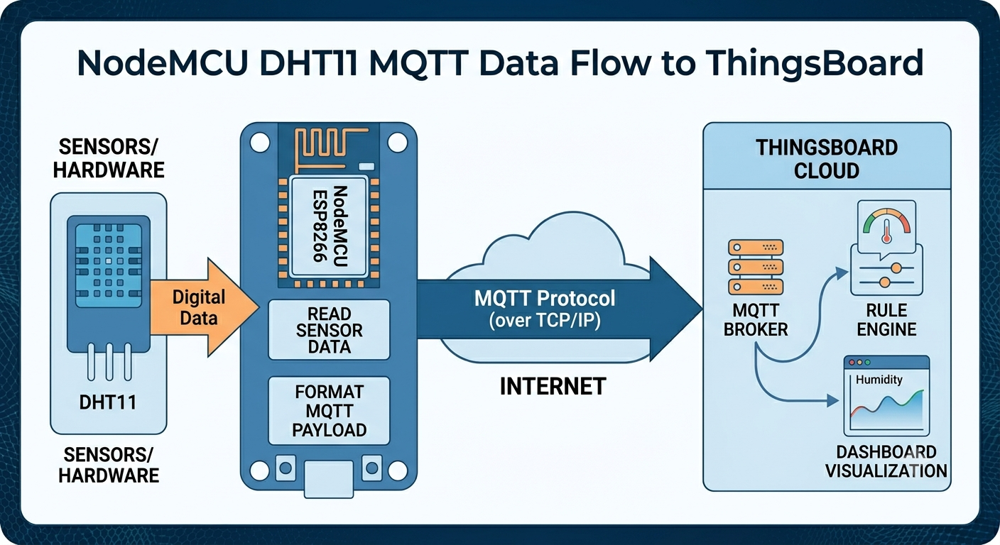
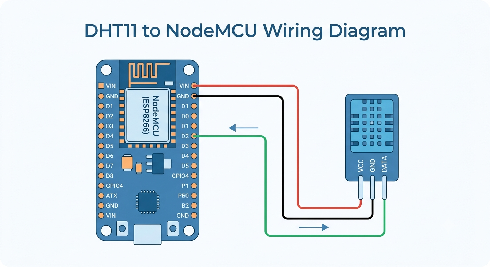

# 🌤️ AmbientMQTT: NodeMCU Weather Station

[](https://platformio.org/)
[](https://www.arduino.cc/)
[](https://thingsboard.io/)
[](LICENSE)

AmbientMQTT is a secure, lightweight, and efficient Internet of Things (IoT) weather station built using a **NodeMCU ESP8266** microcontroller and a **DHT11** temperature and humidity sensor. Telemetry data is parsed locally and transmitted securely over the **MQTT protocol** to a customized dashboard on the **ThingsBoard Cloud**.

---

## 📷 Real Circuit Setup

Below is the physical assembly of the hardware components:


---

## 🔍 Project Overview & Features

Managing microclimates requires continuous data acquisition. This project provides a low-cost, self-healing, and secure solution for transmitting environmental metrics.

### Key Features:
*   **Non-Blocking Telemetry:** Utilizes a non-blocking `millis()` timer instead of CPU-blocking `delay()` calls, ensuring continuous execution of the MQTT client loops.
*   **Decoupled & Secure Config:** Sensitive settings (Wi-Fi credentials, broker tokens) are entirely isolated into a local configuration header (`config.h`), kept safe from public git history via `.gitignore`.
*   **Robust Connection Recovery:** Automatic self-healing reconnection routines for both Wi-Fi networks and the MQTT broker if communication drops.
*   **Telemetry Verification:** Validates data readings (checking for `nan` errors) before payload serialization to avoid sending corrupted points.

---

## 🛠️ System Architecture

The data pipeline runs sequentially from the physical sensor up to the cloud dashboard:



1.  **DHT11 Sensor:** Captures environmental temperature and relative humidity.
2.  **NodeMCU (ESP8266):** Processes the raw digital pulse stream, performs data integrity checks, and serializes metrics into a JSON payload.
3.  **MQTT Client:** Establishes connection to the ThingsBoard broker on the default port `1883`, publishing client-authenticated payloads to the telemetry topic.
4.  **ThingsBoard Cloud:** De-serializes the payload and updates the user-facing dashboard widgets in real-time.



---

## 📦 Bill of Materials (BOM)

| Component | Description | Quantity | Link |
| :--- | :--- | :--- | :--- |
| **NodeMCU v2 (ESP-12E)** | WiFi-enabled ESP8266 development board | 1 | [Datasheet](https://components101.com/development-boards/nodemcu-esp8266-pinout-features-and-datasheet) |
| **DHT11 Sensor** | Basic digital temperature and humidity sensor | 1 | [Datasheet](https://components101.com/sensors/dht11-temperature-sensor) |
| **Jumper Wires** | Female-to-Female breadboard Dupont wires | 3 | - |
| **Micro-USB Cable** | For uploading firmware and serial debugging | 1 | - |

---

## 🔌 Hardware Setup & Pinout

Connect the DHT11 sensor to the NodeMCU development board according to the pin mapping below.

| DHT11 Pin | NodeMCU Pin | GPIO Pin | Cable Color | Purpose |
| :--- | :--- | :--- | :--- | :--- |
| **VCC** | **3V3** | - | Red | 3.3V Power Line |
| **GND** | **GND** | - | Black | System Ground Reference |
| **DATA**| **D2** | **GPIO4** | Yellow | Single-Bus Digital Signal |



---

## 🔒 Configuration & Security Setup

Credentials are separated from the main source files. To construct the local header configuration:

1.  Create a file named `config.h` in the `include/` directory.
2.  Paste the template code below and enter your credentials.

### `include/config.h` Template:
```cpp
#ifndef CONFIG_H
#define CONFIG_H

// Wi-Fi Credentials
#define WIFI_SSID "YOUR_WIFI_SSID"
#define WIFI_PASSWORD "YOUR_WIFI_PASSWORD"

// ThingsBoard Credentials
#define TB_ACCESS_TOKEN "YOUR_THINGSBOARD_ACCESS_TOKEN"

#endif // CONFIG_H
```

### Git Ignored Files
The [.gitignore](.gitignore) contains policies to exclude compile logs and your credential headers from your git version history:
```gitignore
.pio
.vscode/
include/config.h
```

---

## ⚙️ Software Setup & Build Instructions

This project is configured for **PlatformIO IDE** (Visual Studio Code plugin) or the **PlatformIO Core CLI**.

### Required libraries:
These are specified inside your `platformio.ini` project file:
*   `adafruit/DHT sensor library`
*   `adafruit/Adafruit Unified Sensor`
*   `knolleary/PubSubClient`

### Compilation & Upload:
Open your terminal in the project directory and run the following command to compile and upload the firmware to your NodeMCU:
```bash
# Compile project
pio run

# Upload code to the connected board
pio run --target upload

# Open Serial Monitor for logs (speed: 115200)
pio device monitor
```

---

## 🧹 Git Housekeeping & Tracking

To clean build cache, stage documentation files, and push them to your repository, run:

```bash
# 1. Clean build artifacts
pio run --target clean

# 2. Stage updated documentation and assets
git add README.md images/architecture_flow.png images/wiring_diagram.png images/real\ ckt.jpg

# 3. Commit changes
git commit -m "Update README with circuit setups, architecture flows and BOM"

# 4. Push to remote origin
git push
```
